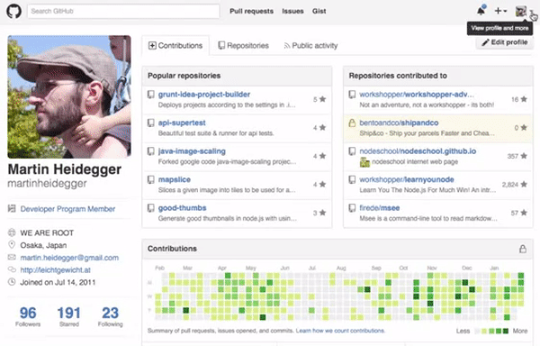

# Open Github Teams Server

The github team api [is private](https://developer.github.com/v3/orgs/teams/#list-teams).

> All actions against teams require at a minimum an authenticated user who is a
> member of the Owners team in the :org being managed. Additionally, OAuth users
> require the "read:org" scope.

This is awesome if you have a private organization but it complicates running an
open organization like [NodeSchool](http://nodeschool.io/).

**open-github-teams to the rescue!!!**

`open-github-teams` is a small [Node.js](https://nodejs.org/en/) server that takes
a little configuration and makes the teams accessible via _JSON_ and _HTML_.

## Get started!

1. Install with `$ npm i open-github-teams -g` _(you might need to prefix `sudo`)_
2. Get a private token from the github settings. The required permissions are `org:read` and `admin:org_hook`. 
3. Start it with `$ env GITHUB_TOKEN="<your-token-here>" GITHUB_ORG="<your-org-here>" open-github-teams`

## Immediate update

By default the system caches the team-data in memory on the server and re-loads it
only every 20 days! To have immediate updates it is possible to setup Github hooks
that invalidate the cache.

Since its not a good idea if others can invalidate the cache you need to create
a `SECRET_KEY` that verifies that github is the one updating.

_Note: to avoid that other people know this code the server has to run via https._

Steps to setup immediate update:

1. Generate a good secret key (_Mac/Linux:_ `head -n 4096 /dev/urandom | shasum -a 256`)
2. Start the server with an additional env variable: `SECRET=<your-secret>`
3. Setup the github webhook to `/webhook` for your server and enter the secret.

When the server receives a webhook properly it will output a notification in the
footer of the landing page.

## Contribute
